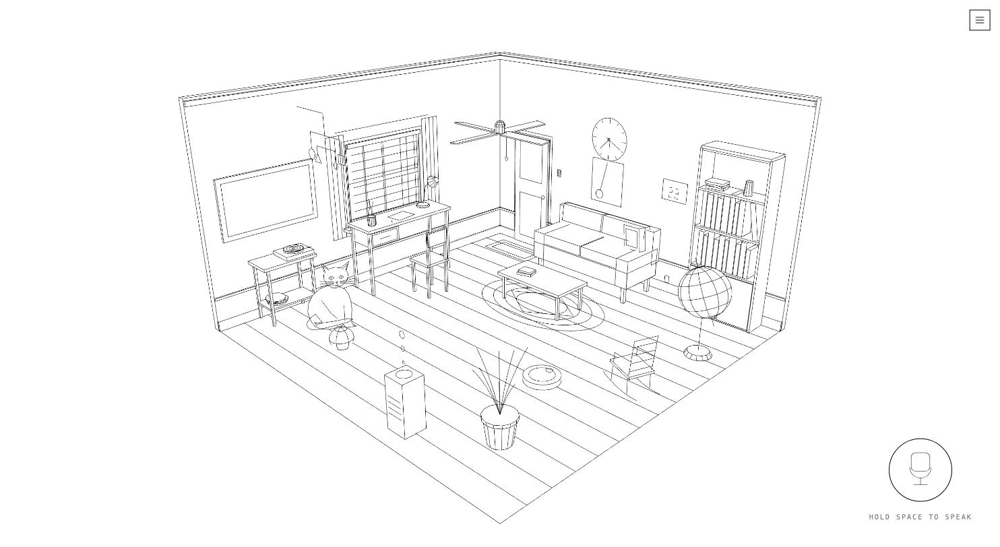

# line-room

A line drawing of a room you can talk to. Hold space, say an English sentence,
and a 45M-parameter model running **inside the page** turns it into a device
call. No server, no API key, no account. One HTML file.



**[Try it →](https://whitefoxx.github.io/line-room/)**

Say *turn on the desk lamp*. Or *it feels stuffy in here* — the model has to work
out that this is about the air purifier, and it does.

---

## How it works

Three pieces, and the interesting part is where they meet.

**The drawing.** Every object is black 1px edges plus white fills, and the fills
are pushed one polygon-offset unit backwards. That is the whole trick: the fills
occlude the lines behind them, so the scene reads as one clean pen drawing with
no hidden-line algorithm, no lighting, no shading and no post-processing. Hover
thickens an object's stroke by swapping in a fat-line copy. This is inherited
from [pure-line-room](https://github.com/Animnia/pure-line-room) and is the
reason the room looks the way it does.

**The model.** [Cactus Needle 2](https://cactuscompute.com/needle) — 45M
parameters at about 2 bits, roughly 14 MB — compiled to WebAssembly and run in a
Web Worker, because inference is synchronous and would otherwise freeze the
frame loop. It is a *tool-calling* model, so it is never asked to write prose:
it gets four JSON function schemas and returns a call plus a confidence.
Grammar-constrained decoding guarantees the output parses. Weights stream once
into the Cache API; after that the tab needs no network at all.

**The registry.** Every object exposes an *absolute* setter, and clicking is
defined as `set(!state)` rather than the other way round. This sounds like
pedantry and is not: a click-toggle is correct for a mouse and wrong for
language, because "turn the lamp off" has to do nothing when the lamp is already
off. The setter reports whether anything actually changed, which is how the room
can answer *already off* instead of silently turning it back on.

```
speech ─> text ─> Needle (worker) ─> tool call ─> {device, value} ─> registry.set() ─> animation
                                                                          └─> caption
```

## Both engines run

Most of what you say to a room does not need a language model. *lights off*,
*open the window*, *the cat* — a keyword parser matches those from the
registry's own vocabulary in about a millisecond, and the model never sees them.
Anything with a sentence around it goes to Needle. The caption tells you which
one answered and how long it took:

```
⚡ keyword · 1ms
◐ needle 2 · 2.4s · conf 0.33
```

That is not a fallback, it is the design. 20 of 22 ordinary smart-home commands
are answered by the parser; the model earns its 14 MB on the other two, where
you say something it has to *interpret*.

## The schema is the whole problem

The single biggest finding here, and it is not subtle. Needle's accuracy on the
same room varies from useless to near-perfect depending only on how the function
schema is shaped:

| schema shape | result |
|---|---|
| one `act(what)` tool, verbs inside the enum | mostly declines; `feed the cat` → `cat_jump`; confidence 0.00 throughout |
| same, with a 40-value enum | worse |
| **verb in the tool NAME, one homogeneous noun argument** | **13/14, confidence 0.86–0.98** |

The rules that fell out of it, each one measured rather than guessed:

- **The verb goes in the tool name**, never in an enum value. `feed(animal)`,
  not `act(action="feed_cat")`.
- **Arguments must be a homogeneous domain noun** — `light`, `appliance`,
  `cover`, `drink`. A generic `thing` fails.
- **No optional arguments.** Adding one optional `level` dropped confidence to
  0.00 on *every* call, including ones that did not use it.
- **No boolean polarity where a verb will do** — `start` and `stop` as separate
  tools beat `set(running=false)`.
- **Enums beat numbers.** "max" is evidence for a named level and not for a
  particular integer.
- **Five tools or fewer**, small enums. Past five, retrieval kicks in and the
  tool you want may not be in the prompt at all.

The four tools this room ships with (`set_light`, `set_appliance`, `set_cover`,
`set_thermostat`) are deliberately shaped like the examples in Needle's own
documentation, because smart home is the domain it was actually trained on and
that is the strongest prior available.

## Fine-tuning made it worse

A LoRA fine-tune on 659 generated examples was trained, evaluated, and thrown
away. It did improve the thing it was trained on — targeted commands 4→5 of 8,
paraphrases 7→9 of 16 — but it destroyed the model's willingness to decline:

```
refusals   base 4/5   tuned 0/5
"what's the population of Tokyo?"  ->  set_fan(speed=high), confidence 0.45
```

A room that confidently turns the fan on when you ask it about Tokyo is worse
than one that admits it did not understand. The base weights ship. The training
code is in [`train/`](train/) anyway, because the negative result is the useful
part.

## Half the furniture is invisible to the model

The clock, the drawer, the globe, the plant, the mug, the cushion, the rocking
chair and the cat are all clickable, all animated, and appear in **no** tool
schema. They answer only to clicks and to the keyword parser. A voice assistant
that also offers to toss a sofa cushion dilutes both the enum and the demo; a
room where half the furniture has gone inert feels broken. Leaving them out of
the schema is how you get both.

## Run it

```sh
git clone https://github.com/whitefoxx/line-room && cd line-room
python3 serve.py 8231
open http://127.0.0.1:8231/
```

A static server is enough — but it does need to be a server, not `file://`,
because the worker and the wasm are fetched. Three files matter:

```
index.html     the entire application, including the worker   812 KB
needle.wasm    Needle's inference engine                      315 KB
needle2.cact   the weights                                     14 MB
```

If `needle2.cact` is missing the page falls back to streaming it straight from
[Hugging Face](https://huggingface.co/Cactus-Compute/needle2), so a shallow
clone still works. `?weights=<url>` points it somewhere else, which is how the
fine-tuned model was A/B'd against the base.

**Browser support.** Chrome and Edge for the full experience. Speech
*recognition* is `webkitSpeechRecognition`, which is Chrome and Safari only, and
which — unlike everything else here — is not on-device: Chrome streams the audio
to Google. That is the only thing in this project that leaves your machine. The
room itself, the model and the inference are entirely local, and every browser
can click.

**On a phone** the camera walks backwards until the whole room fits the narrower
frame, so portrait shows the room as a band rather than a fisheye. The 14 MB
download is worth knowing about on mobile data.

## One file, on purpose

`index.html` is the application: markup, CSS, the room's geometry, the animation
system, the audio synthesis, the device registry, the parser, the worker and the
wiring — about 2,600 readable lines, in that order. three.js and Needle's
emscripten glue are inlined at the *bottom*, minified and unmodified, so opening
the file shows you the project rather than 600 KB of somebody else's build
output. The worker is assembled at runtime from an inert `<script type="text/plain">`
block and handed to `new Worker()` as a blob, which is how a single-file page
still gets its inference off the main thread.

There is no build step and no dependency to install.

## Notes

[`docs/pitfalls.md`](docs/pitfalls.md) has the things that cost real debugging
time, written up as symptom / cause / fix. A sample, because they are not
guessable:

- `needle_load` does not copy its buffer. Freeing it does not crash — the
  forward pass quietly runs on garbage, the grammar keeps the output
  well-formed, and every query comes back empty at confidence 0.2. A memory bug
  wearing a refusal as a disguise.
- `vector-effect: non-scaling-stroke` makes Chrome measure `stroke-dasharray` in
  *device* pixels while the path length stays in user units, and it ignores
  `pathLength`. The dial's rim was permanently half-drawn — on retina only.
- Chrome's speech synthesis can wedge such that `speaking` stays true forever,
  no events fire, and nothing is ever heard again until the browser restarts.

## Thanks

To **[Animnia](https://github.com/Animnia/pure-line-room)** for the room — the
drawing style is the reason this project exists at all, and it was a pleasure to
build on.

To **[Cactus](https://cactuscompute.com/needle)** for putting a genuinely
capable tool-caller into 14 MB and shipping a WebAssembly build of it. Running a
real function-calling model in a browser tab with no server is a new thing to be
able to do.

## License

Apache-2.0. See [LICENSE](LICENSE) and [NOTICE](NOTICE) — the room, the model
and three.js all carry their own attribution there.
